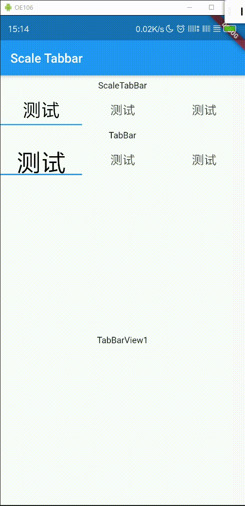

# Flutter Scale TabBar

> ## 注意
* 以迁移至空安全，非空安全请使用
`scale_tabbar.dart.nonnullsafety`,
需要手动去除`.nonnullsafety`

> ## 特性

* 缓解tab切换文字抖动问题
* 添加双击事件(不推荐使用)
* 默认去除点击水波纹
* 可自定义水波纹颜色和圆角
* 与官方TabBar使用方法相同

> ## 效果预览

-|-|-
-|-|-
||

> ## 代码示例

```dart
ScaleTabBar(
    tabs: _tabs,

    ///添加双击事件会导致[onTap]响应延时,不推荐使用
    // onDoubleTap: (index) {
    //   print('double tap:$index');
    // },

    labelColor: Colors.black,
    labelStyle: const TextStyle(fontSize: 40),
    unselectedLabelStyle: const TextStyle(fontSize: 20),

    //波纹属性
    splashColor: Colors.blue,
    highlightColor: Colors.redAccent,
    borderRadius: BorderRadius.circular(10),
),
```

> ### 完整示例代码 : [main.dart](/lib/main.dart)
